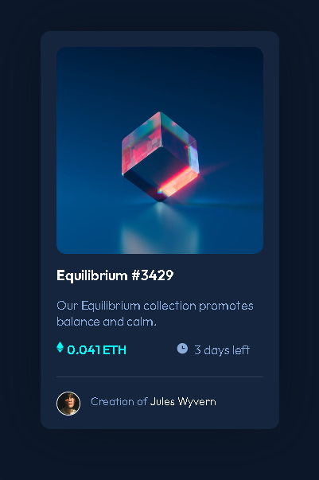

# Frontend Mentor - NFT preview card component solution

This is a solution to the [NFT preview card component challenge on Frontend Mentor](https://www.frontendmentor.io/challenges/nft-preview-card-component-SbdUL_w0U). Frontend Mentor challenges help you improve your coding skills by building realistic projects. 

## Table of contents

- [Overview](#overview)
  - [The challenge](#the-challenge)
  - [Screenshot](#screenshot)
  - [Links](#links)
- [My process](#my-process)
  - [Built with](#built-with)
  - [What I learned](#what-i-learned)
  - [Continued development](#continued-development)
  - [Useful resources](#useful-resources)
- [Author](#author)
- [Acknowledgments](#acknowledgments)

**Note: Delete this note and update the table of contents based on what sections you keep.**

## Overview

### The challenge

Users should be able to:

- View the optimal layout depending on their device's screen size
- See hover states for interactive elements

### Screenshot

### Links

- Solution URL: 
- Live Site URL: [Add live site URL here](https://your-live-site-url.com)

## My process

- I started at the top.
- I began with the HTML and input everything that was static first. 
- Once I completed the static version, I added the overlay and other UI interactions. 

### Built with

- Semantic HTML5 markup
- CSS custom properties
- CSS Grid

### What I learned

In this section I learned a way to create an overlay with a specific color and an image/icon. I had used an overlay property that was limited to the HSL of the image itself; this creates an entirely new overlay, removing the previous limitations. 

.view {
    position: absolute;
    top: 110px;
    left: 110px;
}

.nft-img-overlay {
    position: relative;
    width: 100%;
    height: 260px;
    margin: auto;
    opacity: 0;
    transition: 0.5s ease-in-out;
    box-shadow: inset 0 0 0 130px rgb(0, 255, 247, 0.4);
    border-radius: 12px;
    transform: translateY(-260px);
}

.nft-img-overlay:hover {
    opacity: 1;
}

Another thing I learned was, the drop-shadow filter for the card. I was looking at others completed work after I finished mine and was proud I included that where most others had not. 

### Continued development

This was my first Frontend Mentor challenge and plan to continue these challenges until I can code them without looking up some of the more basic CSS. I have a pretty solid grasp on HTML and how to lay things out there, so my focus is the CSS. 

## Author

- Website - [Add your name here](https://www.your-site.com)
- Frontend Mentor - [@yourusername](https://www.frontendmentor.io/profile/yourusername)
- Twitter - [@yourusername](https://www.twitter.com/yourusername)

**Note: Delete this note and add/remove/edit lines above based on what links you'd like to share.**

## Acknowledgments

Google, MDN, Stackoverflow
